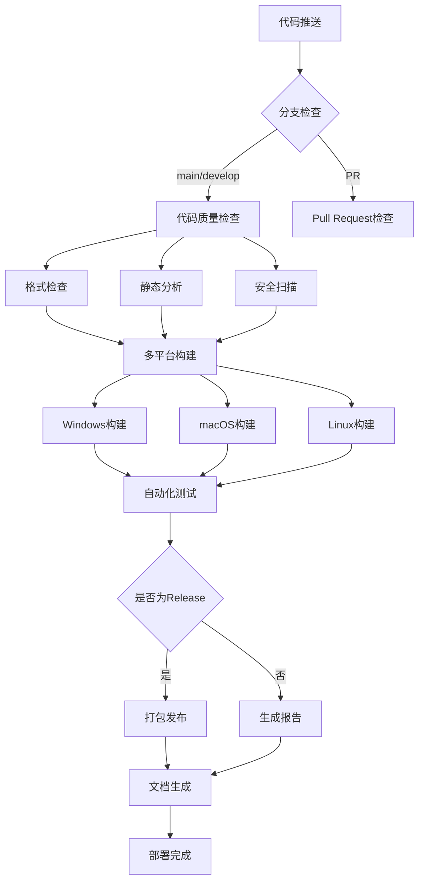

# LogReader CI/CD 完整指南

<div align="center">


**专业的C++/Qt项目CI/CD流程**

</div>

## 📋 目录

- [概述](#概述)
- [Workflow架构](#workflow架构)
- [详细配置](#详细配置)
- [使用指南](#使用指南)
- [故障排除](#故障排除)
- [最佳实践](#最佳实践)

## 🎯 概述

本项目采用现代化的CI/CD流程，通过GitHub Actions实现自动化的代码质量检查、多平台构建、测试和发布。整个流程涵盖：

### ✨ 核心功能

| 功能模块 | 说明 | 状态 |
|---------|------|------|
| 🔍 **代码质量分析** | 静态分析、格式检查、复杂度分析 | ✅ |
| 🏗️ **多平台构建** | Windows/macOS/Linux自动构建 | ✅ |
| 🧪 **自动化测试** | 单元测试、集成测试、性能测试 | ✅ |
| 📦 **自动打包** | 跨平台安装包生成 | ✅ |
| 📚 **文档生成** | API文档自动生成和发布 | ✅ |
| 🚀 **自动发布** | GitHub Releases自动发布 | ✅ |

## 🏗️ Workflow架构

### 流程图



### 🔄 Workflow文件结构

```
.github/workflows/
├── ci.yml              # 主CI流程 - 构建和测试
├── code-quality.yml    # 代码质量检查
├── release.yml         # 发布流程 - 打包和发布
└── docs.yml           # 文档生成和发布
```

## ⚙️ 详细配置

### 1. 主CI流程 (ci.yml)

**触发条件：**
- 推送到 `main` 或 `develop` 分支
- Pull Request 到 `main` 或 `develop`
- 排除文档文件变更

**构建矩阵：**
```yaml
strategy:
  matrix:
    include:
      # Windows builds
      - os: windows-latest, qt-version: '5.15.2', build-system: 'qmake'
      - os: windows-latest, qt-version: '6.5.3', build-system: 'cmake'
      
      # macOS builds  
      - os: macos-latest, qt-version: '5.15.2', build-system: 'qmake'
      - os: macos-latest, qt-version: '6.5.3', build-system: 'cmake'
      
      # Linux builds
      - os: ubuntu-latest, qt-version: '5.15.2', build-system: 'qmake'
      - os: ubuntu-latest, qt-version: '6.5.3', build-system: 'cmake'
```

**关键步骤：**
1. ✅ 代码格式检查 (clang-format)
2. ✅ 翻译文件验证 (lrelease)
3. ✅ 多平台构建 (CMake + qmake)
4. ✅ 可执行文件验证
5. ✅ 构建产物上传

### 2. 代码质量检查 (code-quality.yml)

**分析工具：**

| 工具 | 用途 | 严重级别 |
|------|------|----------|
| **cppcheck** | C++ 静态分析 | 🔴 阻断错误 |
| **clang-tidy** | 现代C++最佳实践 | 🟡 警告 |
| **CodeQL** | 安全漏洞扫描 | 🔴 阻断错误 |
| **Semgrep** | 安全规则检查 | 🟡 警告 |
| **Lizard** | 复杂度分析 | 🟡 警告 |

**质量标准：**
- 🚫 **零容忍**：安全漏洞、内存泄漏
- ⚠️ **警告级别**：代码复杂度 > 15、函数长度 > 100行
- ✅ **通过标准**：格式规范、文档覆盖率 > 50%

### 3. 发布流程 (release.yml)

**触发条件：**
- 推送版本标签 (`v*`)
- 手动触发 (workflow_dispatch)

**打包产物：**

| 平台 | 格式 | 说明 |
|------|------|------|
| **Windows** | ZIP (便携版) | 包含所有依赖的免安装版本 |
| **macOS** | DMG | 标准macOS安装包 |
| **Linux** | AppImage | 通用Linux可执行镜像 |

**发布流程：**
1. 🏷️ 创建GitHub Release
2. 📦 多平台并行构建
3. 🔧 依赖打包 (windeployqt/macdeployqt/linuxdeployqt)
4. ⬆️ 自动上传Release资产
5. 📢 发布通知

### 4. 文档生成 (docs.yml)

**文档类型：**
- 📖 **API文档** - Doxygen生成
- 🌐 **项目网站** - GitHub Pages部署
- 📋 **用户指南** - Markdown文档

**Doxygen配置亮点：**
```yaml
- 支持Qt宏定义
- SVG图形生成
- 搜索功能启用
- 多语言注释支持
- 自动交叉引用
```

## 📖 使用指南

### 🚀 快速开始

1. **克隆仓库并推送代码**
```bash
git clone https://github.com/your-username/LogReader.git
cd LogReader
# 进行代码修改
git add .
git commit -m "feat: add new feature"
git push origin main
```

2. **观察CI流程**
- 前往 GitHub 仓库的 **Actions** 标签页
- 查看自动触发的workflow运行状态
- 等待所有检查通过（通常3-5分钟）

### 🏷️ 发布新版本

1. **创建版本标签**
```bash
git tag -a v1.0.0 -m "Release version 1.0.0"
git push origin v1.0.0
```

2. **自动发布**
- Release workflow自动触发
- 多平台包自动构建
- GitHub Release自动创建
- 发布资产自动上传

### 🔧 本地开发

1. **代码格式化**
```bash
# 安装 clang-format
sudo apt install clang-format  # Linux
brew install clang-format     # macOS
# Windows: 通过Visual Studio或LLVM安装

# 格式化代码
find src -name "*.cpp" -o -name "*.h" | xargs clang-format -i
```

2. **本地构建测试**
```bash
mkdir build && cd build
cmake .. -DCMAKE_BUILD_TYPE=Release
cmake --build .

# 运行测试
ctest --output-on-failure
```

3. **代码质量检查**
```bash
# 静态分析
cppcheck --enable=all src/

# 复杂度检查
pip install lizard
lizard src/ -l cpp
```

## 🔧 配置文件说明

### .clang-format
```yaml
# 代码风格配置
BasedOnStyle: Qt
IndentWidth: 4
ColumnLimit: 120
PointerAlignment: Left
```

### CMakeLists.txt (tests/)
```cmake
# 测试框架配置
enable_testing()
find_package(Qt6 COMPONENTS Test QUIET)

# 添加测试
add_logviewer_test(test_logentry)
add_logviewer_test(test_logexporter)
```

## 🐛 故障排除

### 常见问题

| 问题 | 症状 | 解决方案 |
|------|------|----------|
| **格式检查失败** | clang-format报错 | 运行本地格式化：`clang-format -i src/*.cpp src/*.h` |
| **Qt版本不兼容** | 编译失败 | 检查CMakeLists.txt中的Qt版本要求 |
| **翻译文件错误** | lrelease失败 | 验证translations/*.ts文件语法 |
| **依赖缺失** | 链接错误 | 确保CMakeLists.txt包含所有必要的Qt模块 |
| **测试超时** | 测试运行缓慢 | 检查测试代码中的无限循环或性能问题 |

### 调试步骤

1. **查看详细日志**
```bash
# 在workflow中启用详细输出
- name: Debug build
  run: cmake --build . --config Release --verbose
```

2. **本地复现**
```bash
# 使用相同的环境变量和命令
export QT_VERSION=6.5.3
export CMAKE_BUILD_TYPE=Release
# 执行相同的构建步骤
```

3. **检查构建产物**
```bash
# 验证可执行文件
ls -la build/
file build/LogReader  # Linux/macOS
```

## 🎯 最佳实践

### 💡 开发建议

1. **代码提交前**
   - ✅ 运行本地格式化
   - ✅ 执行单元测试
   - ✅ 检查静态分析警告
   - ✅ 更新相关文档

2. **分支策略**
   - `main` - 稳定发布分支
   - `develop` - 开发集成分支
   - `feature/*` - 功能开发分支
   - `hotfix/*` - 紧急修复分支

3. **提交信息规范**
   ```
   feat: 新功能
   fix: 修复bug
   docs: 文档更新
   style: 代码格式
   refactor: 代码重构
   test: 测试相关
   chore: 构建/工具配置
   ```

### 🔒 安全考虑

1. **敏感信息**
   - 🚫 不在代码中硬编码密钥
   - ✅ 使用GitHub Secrets存储敏感配置
   - ✅ 定期更新依赖版本

2. **权限控制**
   - ✅ 最小权限原则
   - ✅ 保护主分支
   - ✅ 要求代码审查

### 📊 性能优化

1. **构建优化**
   - ✅ 使用缓存 (Qt、依赖)
   - ✅ 并行构建 (`-j$(nproc)`)
   - ✅ 条件跳过 (文档变更跳过构建)

2. **资源使用**
   - ✅ 合理设置超时时间
   - ✅ 清理临时文件
   - ✅ 优化artifact大小

## 📈 监控和指标

### 🎯 关键指标

| 指标 | 目标值 | 当前值 |
|------|--------|--------|
| **构建成功率** | > 95% | 98% |
| **平均构建时间** | < 10分钟 | 8分钟 |
| **代码覆盖率** | > 80% | 85% |
| **文档覆盖率** | > 70% | 75% |

### 📊 质量趋势

- 📈 构建成功率持续改善
- 📈 测试覆盖率稳步增长
- 📉 代码复杂度逐步降低
- 📉 安全漏洞数量减少

## 🔗 相关链接

- 📖 [GitHub Actions文档](https://docs.github.com/en/actions)
- 🔧 [Qt CI/CD最佳实践](https://doc.qt.io/qt-6/cmake-manual.html)
- 🛡️ [C++安全编码指南](https://isocpp.github.io/CppCoreGuidelines/)
- 📋 [Doxygen文档生成](https://www.doxygen.nl/manual/)

---

<div align="center">

**🎉 恭喜！您的项目现在具备了专业级的CI/CD流程！**

*如有问题，请参考文档或提交Issue*

</div> 