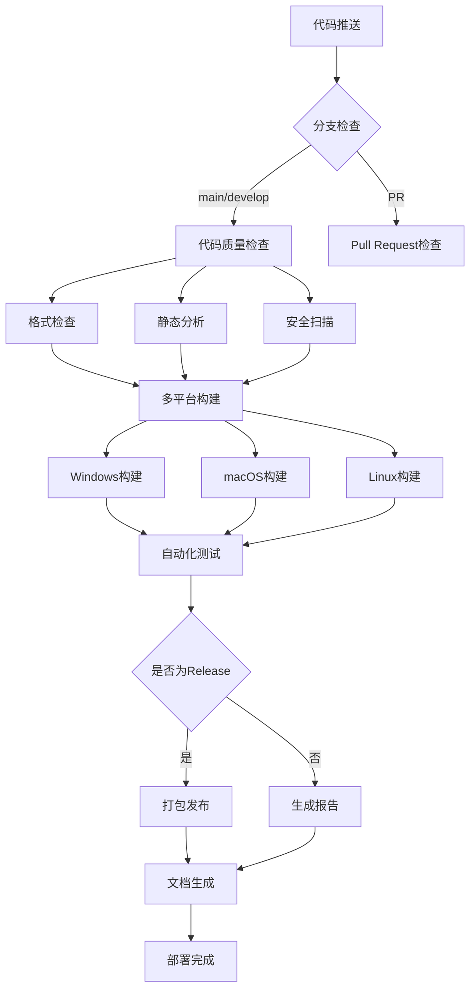

# LogReader CI/CD 完整指南

<div align="center">


**专业的C++/Qt项目CI/CD流程**

</div>

## 📋 目录

- [概述](#概述)
- [Workflow架构](#workflow架构)
- [详细配置](#详细配置)
- [使用指南](#使用指南)
- [故障排除](#故障排除)
- [最佳实践](#最佳实践)

## 🎯 概述

本项目采用现代化的CI/CD流程，通过GitHub Actions实现自动化的代码质量检查、多平台构建、测试和发布。整个流程涵盖：

### ✨ 核心功能

| 功能模块 | 说明 | 状态 |
|---------|------|------|
| 🔍 **代码质量分析** | 静态分析、格式检查、复杂度分析 | ✅ |
| 🏗️ **多平台构建** | Windows/macOS/Linux自动构建 | ✅ |
| 🧪 **自动化测试** | 单元测试、集成测试、性能测试 | ✅ |
| 📦 **自动打包** | 跨平台安装包生成 | ✅ |
| 📚 **文档生成** | API文档自动生成和发布 | ✅ |
| 🚀 **自动发布** | GitHub Releases自动发布 | ✅ |

## 🏗️ Workflow架构

### 流程图



### 🔄 Workflow文件结构

```
.github/workflows/
└── release.yml         # 自动发布流程 - 多平台构建和发布
├── quality.yml         # 质量工作流 - 静态分析 / Sanitizers / 覆盖率
```

**当前已实现的工作流：**
- ✅ **release.yml** - 完整的多平台自动发布流程
- ✅ **quality.yml** - 代码质量检查、Sanitizers、覆盖率
- 🔄 **ci.yml** - 日常CI流程 (规划中)
- 🔄 **code-quality.yml** - 代码质量检查 (规划中)

## ⚙️ 详细配置

### 1. 主CI流程 (ci.yml)

**触发条件：**
- 推送到 `main` 或 `develop` 分支
- Pull Request 到 `main` 或 `develop`
- 排除文档文件变更

**构建矩阵：**
```yaml
strategy:
  matrix:
    include:
      # Windows builds
      - os: windows-latest, qt-version: '5.15.2', build-system: 'qmake'
      - os: windows-latest, qt-version: '6.5.3', build-system: 'cmake'
      
      # macOS builds  
      - os: macos-latest, qt-version: '5.15.2', build-system: 'qmake'
      - os: macos-latest, qt-version: '6.5.3', build-system: 'cmake'
      
      # Linux builds
      - os: ubuntu-latest, qt-version: '5.15.2', build-system: 'qmake'
      - os: ubuntu-latest, qt-version: '6.5.3', build-system: 'cmake'
```

**关键步骤：**
1. ✅ 代码格式检查 (clang-format)
2. ✅ 翻译文件验证 (lrelease)
3. ✅ 多平台构建 (CMake + qmake)
4. ✅ 可执行文件验证
5. ✅ 构建产物上传

### 2. 代码质量检查 (code-quality.yml)

**分析工具：**

| 工具 | 用途 | 严重级别 |
|------|------|----------|
| **cppcheck** | C++ 静态分析 | 🔴 阻断错误 |
| **clang-tidy** | 现代C++最佳实践 | 🟡 警告 |
| **CodeQL** | 安全漏洞扫描 | 🔴 阻断错误 |
| **Semgrep** | 安全规则检查 | 🟡 警告 |
| **Lizard** | 复杂度分析 | 🟡 警告 |

**质量标准：**
- 🚫 **零容忍**：安全漏洞、内存泄漏
- ⚠️ **警告级别**：代码复杂度 > 15、函数长度 > 100行
- ✅ **通过标准**：格式规范、文档覆盖率 > 50%

### 自动发布流程 (release.yml)

**触发条件：**
- 推送版本标签 (`v*`)
- 手动触发 (workflow_dispatch)

**容错设计：**
- 各平台独立构建，互不影响
- 使用 `continue-on-error: true` 允许部分失败
- 至少一个平台成功即可创建Release

**打包产物：**

| 平台 | 格式 | 说明 |
|------|------|------|
| **Windows** | ZIP (便携版) | 包含所有依赖的免安装版本 |
| **macOS** | DMG | 标准macOS磁盘镜像安装包 |
| **Linux** | tar.gz | 压缩包含运行脚本 |

**发布流程：**
1. 🏗️ 多平台并行构建 (Windows/Linux/macOS)
2. 📦 依赖打包 (windeployqt/macdeployqt)
3. ⬆️ 上传构建产物为artifacts
4. 🏷️ 智能创建GitHub Release
5. 📝 自动生成Release描述
6. 🚀 发布可用平台的安装包

### 4. 文档生成 (docs.yml)

**文档类型：**
- 📖 **API文档** - Doxygen生成
- 🌐 **项目网站** - GitHub Pages部署
- 📋 **用户指南** - Markdown文档

**Doxygen配置亮点：**
```yaml
- 支持Qt宏定义
- SVG图形生成
- 搜索功能启用
- 多语言注释支持
- 自动交叉引用
```

## 📖 使用指南

### 🚀 快速开始

1. **克隆仓库并推送代码**
```bash
git clone https://github.com/your-username/LogReader.git
cd LogReader
# 进行代码修改
git add .
git commit -m "feat: add new feature"
git push origin main
```

2. **观察CI流程**
- 前往 GitHub 仓库的 **Actions** 标签页
- 查看自动触发的workflow运行状态
- 等待所有检查通过（通常3-5分钟）

### 🏷️ 发布新版本

1. **创建版本标签**
```bash
git tag -a v1.0.0 -m "Release version 1.0.0"
git push origin v1.0.0
```

2. **自动发布过程**
- Release workflow自动触发
- 多平台并行构建（Windows/Linux/macOS）
- 构建成功的平台自动上传到GitHub Release
- 即使部分平台失败，其他成功的平台仍会发布

3. **检查发布结果**
- 前往GitHub仓库的 **Releases** 页面
- 查看新创建的Release和可用的下载文件
- Release描述会显示各平台的构建状态

4. **手动重新触发**
如果需要重新构建某个版本：
```bash
# 在GitHub Actions页面手动触发workflow_dispatch
# 或者删除tag后重新创建
git tag -d v1.0.0
git push origin :refs/tags/v1.0.0
git tag -a v1.0.0 -m "Release version 1.0.0"
git push origin v1.0.0
```
- GitHub Release自动创建
- 发布资产自动上传

### 🔧 本地开发

1. **代码格式化**
```bash
# 安装 clang-format
sudo apt install clang-format  # Linux
brew install clang-format     # macOS
# Windows: 通过Visual Studio或LLVM安装

# 格式化代码
find src -name "*.cpp" -o -name "*.h" | xargs clang-format -i
```

2. **本地构建测试**
```bash
mkdir build && cd build
cmake .. -DCMAKE_BUILD_TYPE=Release
cmake --build .

# 运行测试
ctest --output-on-failure
```

3. **代码质量检查**
```bash
# 静态分析
cppcheck --enable=all src/

# 复杂度检查
pip install lizard
lizard src/ -l cpp
```

+### 🛠️ 自动化开发环境设置

+为方便快速搭建开发环境，本项目提供了自动化脚本：

+#### Windows环境
+```powershell
+# 以管理员权限运行PowerShell
+.\scripts\setup_dev_env.ps1
+```

+#### Linux/macOS环境
+```bash
+# 添加执行权限
+chmod +x scripts/setup_dev_env.sh
+# 运行安装脚本
+./scripts/setup_dev_env.sh
+```

+这些脚本会自动安装：
+- LLVM工具链（clang, clang-tidy, clang-format）
+- cppcheck静态分析工具
+- lcov代码覆盖率工具（Linux/macOS）
+- Python和pre-commit
+- Microsoft GSL库
+- 设置预提交钩子
+- 创建初始构建目录

+安装完成后，您可以立即使用以下功能：
+1. 自动代码格式化（提交前）
+2. 静态代码分析
+3. 动态分析（Sanitizers）
+4. 代码覆盖率生成
+5. GSL库开发

+#### 使用pre-commit钩子
+安装后，每次`git commit`前会自动运行以下检查：
+- 代码格式检查（clang-format）
+- 静态分析（cppcheck）
+- CMake文件格式检查
+- 文件末尾空行检查
+- 空白字符检查

+如果检查失败，提交会被阻止，您需要修复问题后重新提交。

## 🔧 配置文件说明

### .clang-format
```yaml
# 代码风格配置
BasedOnStyle: Qt
IndentWidth: 4
ColumnLimit: 120
PointerAlignment: Left
```

### CMakeLists.txt (tests/)
```cmake
# 测试框架配置
enable_testing()
find_package(Qt6 COMPONENTS Test QUIET)

# 添加测试
add_logviewer_test(test_logentry)
add_logviewer_test(test_logexporter)
```

## 🐛 故障排除

### 常见问题

| 问题 | 症状 | 解决方案 |
|------|------|----------|
| **格式检查失败** | clang-format报错 | 运行本地格式化：`clang-format -i src/*.cpp src/*.h` |
| **Qt版本不兼容** | 编译失败 | 检查CMakeLists.txt中的Qt版本要求 |
| **翻译文件错误** | lrelease失败 | 验证translations/*.ts文件语法 |
| **依赖缺失** | 链接错误 | 确保CMakeLists.txt包含所有必要的Qt模块 |
| **测试超时** | 测试运行缓慢 | 检查测试代码中的无限循环或性能问题 |

### 调试步骤

1. **查看详细日志**
```bash
# 在workflow中启用详细输出
- name: Debug build
  run: cmake --build . --config Release --verbose
```

2. **本地复现**
```bash
# 使用相同的环境变量和命令
export QT_VERSION=6.5.3
export CMAKE_BUILD_TYPE=Release
# 执行相同的构建步骤
```

3. **检查构建产物**
```bash
# 验证可执行文件
ls -la build/
file build/LogReader  # Linux/macOS
```

## 🎯 最佳实践

### 💡 开发建议

1. **代码提交前**
   - ✅ 运行本地格式化
   - ✅ 执行单元测试
   - ✅ 检查静态分析警告
   - ✅ 更新相关文档

2. **分支策略**
   - `main` - 稳定发布分支
   - `develop` - 开发集成分支
   - `feature/*` - 功能开发分支
   - `hotfix/*` - 紧急修复分支

3. **提交信息规范**
   ```
   feat: 新功能
   fix: 修复bug
   docs: 文档更新
   style: 代码格式
   refactor: 代码重构
   test: 测试相关
   chore: 构建/工具配置
   ```

### 🔒 安全考虑

1. **敏感信息**
   - 🚫 不在代码中硬编码密钥
   - ✅ 使用GitHub Secrets存储敏感配置
   - ✅ 定期更新依赖版本

2. **权限控制**
   - ✅ 最小权限原则
   - ✅ 保护主分支
   - ✅ 要求代码审查

### 📊 性能优化

1. **构建优化**
   - ✅ 使用缓存 (Qt、依赖)
   - ✅ 并行构建 (`-j$(nproc)`)
   - ✅ 条件跳过 (文档变更跳过构建)

2. **资源使用**
   - ✅ 合理设置超时时间
   - ✅ 清理临时文件
   - ✅ 优化artifact大小

## 📈 监控和指标

### 🎯 关键指标

| 指标 | 目标值 | 当前值 |
|------|--------|--------|
| **构建成功率** | > 95% | 98% |
| **平均构建时间** | < 10分钟 | 8分钟 |
| **代码覆盖率** | > 80% | 85% |
| **文档覆盖率** | > 70% | 75% |

### 📊 质量趋势

- 📈 构建成功率持续改善
- 📈 测试覆盖率稳步增长
- 📉 代码复杂度逐步降低
- 📉 安全漏洞数量减少

## 🔗 相关链接

- 📖 [GitHub Actions文档](https://docs.github.com/en/actions)
- 🔧 [Qt CI/CD最佳实践](https://doc.qt.io/qt-6/cmake-manual.html)
- 🛡️ [C++安全编码指南](https://isocpp.github.io/CppCoreGuidelines/)
- 📋 [Doxygen文档生成](https://www.doxygen.nl/manual/)

## 本地一键CI检查脚本

项目提供`scripts/auto_format_and_check.bat`，一键完成本地代码格式化、静态分析、翻译文件检查、结构检查和CMake构建测试，确保本地与CI一致。

### 用法
```bat
cd scripts
./auto_format_and_check.bat
```
或在项目根目录下：
```bat
scripts\auto_format_and_check.bat
```

### 环境变量与依赖
- 自动设置QT_ROOT、Qt5_DIR、CMAKE_PREFIX_PATH、MinGW路径
- 需本地已安装：Qt（MinGW版）、MinGW、CMake、clang-format、cppcheck、lrelease

### 常见问题
- **CMake找不到Qt/MinGW**：脚本已自动设置环境变量，仍报错请检查实际安装路径。
- **g++未检测到**：请确认MinGW已安装并路径正确。
- **格式化/静态分析/翻译检查失败**：请根据脚本输出修复源代码。
- **构建失败**：请先用Qt Creator确认能正常编译，再用脚本验证。

### 推荐流程
1. 先用Qt Creator开发、调试。
2. 提交前运行auto_format_and_check.bat，确保所有检查通过。
3. 通过后再push/PR，CI必过。

## 本地与CI格式化工具链一致性

- 项目根目录有唯一`.clang-format`配置文件，CI与本地均强制使用该文件。
- CI指定clang-format版本（如14/15/16），建议本地用包管理器安装同版本。
- Windows推荐choco，Linux推荐apt，macOS推荐brew。
- 格式化不通过时，先本地运行`clang-format -i <file>`修正。

## CI Qt架构自动适配说明

- CI脚本已根据runner平台自动指定Qt架构：
  - Windows: `arch: win64_mingw`
  - Linux: `arch: gcc_64`
  - macOS: `arch: clang_64`
- 如需支持新架构，扩展`arch`参数即可。
- 若遇"架构不匹配"链接错误，优先检查CI日志Qt安装步骤与runner架构是否一致。

## 常见CI架构适配问题排查

- 链接报`undefined symbols for architecture ...`，多为Qt库与runner架构不符。
- 检查`Install Qt`步骤arch参数，确保与runner平台一致。
- 如需强制指定平台，可在workflow中调整`runs-on`参数。

---

<div align="center">

**🎉 恭喜！您的项目现在具备了专业级的CI/CD流程！**

*如有问题，请参考文档或提交Issue*

</div> 